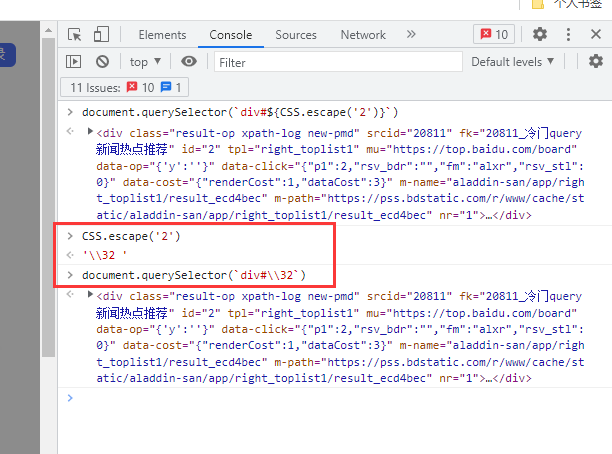
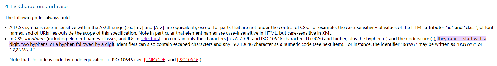
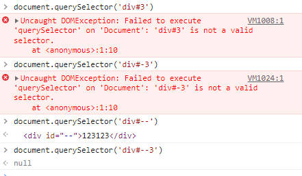

### 现象

- 百度网页使用 document.querySelector('div#2') 直接报错，但是 document.getElementById('2') 却可以查询到 DOM 节点。

### 解决办法

- 用 CSS.escape 转义。 document.querySelector(\`div#${CSS.escape('2')}`)

### 原因

- 标准中提到 CSS 标识符(包括元素名称、类和选择器中的 id)只能包含字符[a-zA-Z0-9]和 iso10646 字符 U+00A0 及以上，加上连字符(-)和下划线(\_); 不能以数字、两个连字符或连字符后接数字开头。
- 不过实践中发现两个连接符是可以正常用的，不知道是不是部分浏览器已经兼容。
- 
